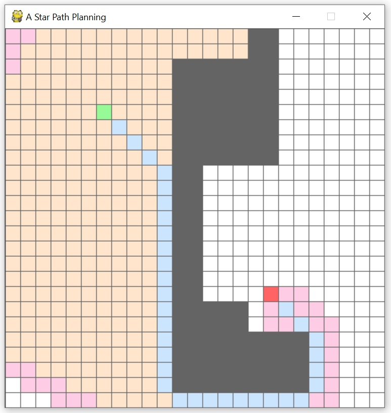

# A-Star-Algorithm
Plan a shortest path from a given start position to a given goal position using A* algorithm.

### Install python library
```
pip install pygame
```
### Window interaction
Set start position
```
Select "LMB" once to set start position.
```
Set goal position
```
Once start poisiton is set, select "LMB" again to set goal position.
```
Set obstacle
```
Once start and goal positions are set, select "LMB" again to set obstacle.
Repeat again to set obstacle
```
Deselect selection
```
Press "RMB" to deselect selection.
```
Run the algorithm
```
Press "SPACE" to run the algorithm.
```
Reset
```
Press "R" to reset all selection.
```
## Output


### Color representation
```
Start - Green
Goal - Red
Obstacle - Grey
Open list - Orange
Closed list - Pink
Shortest path - Blue
```
